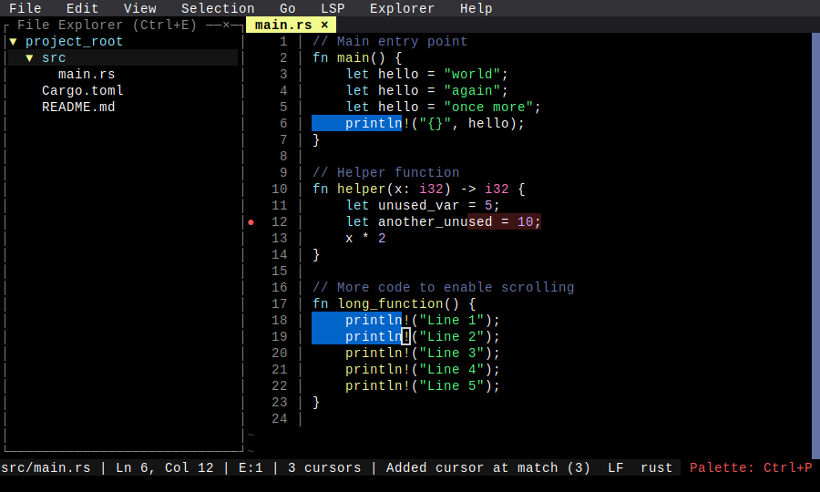

# Comprehensive UI A

**Category**: Visual Regression

*File explorer open, line wrap on, multicursors, diagnostics, scrolled*

---

## Step 1: state_a

*File explorer open + syntax highlighting + diagnostics + multicursors + scrolled*

