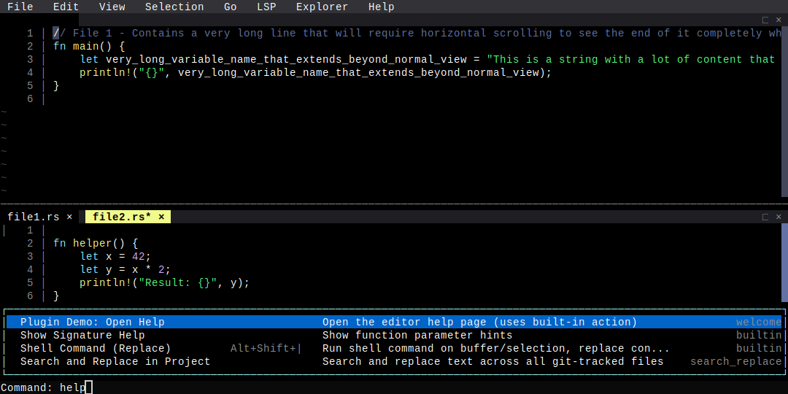

# Comprehensive UI B

**Category**: Visual Regression

*Command palette open, split view, line wrap off, horizontal scroll*

---

## Step 1: state_b

*Split view + command palette open + line wrap off + horizontal scroll*

