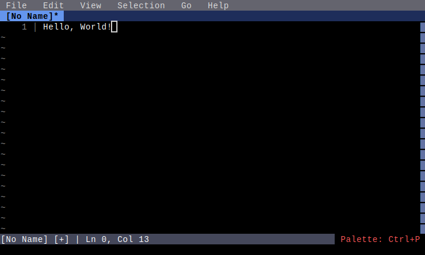
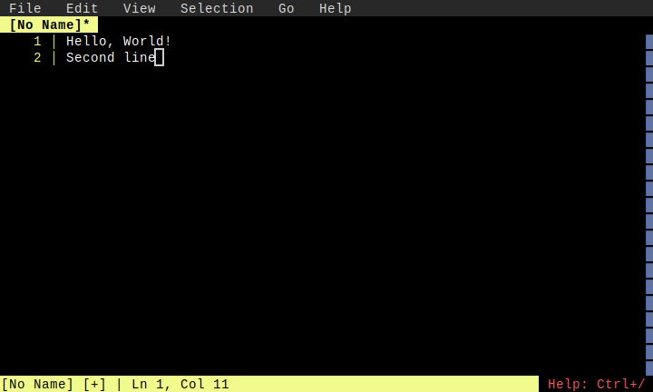

# Basic Editing

**Category**: Core Features

*Basic text editing operations in the editor*

---

## Step 1: initial

*Empty editor on startup*

## Step 2: typed_text

*Text typed into buffer*

## Step 3: multiline

*Multiple lines of text*

