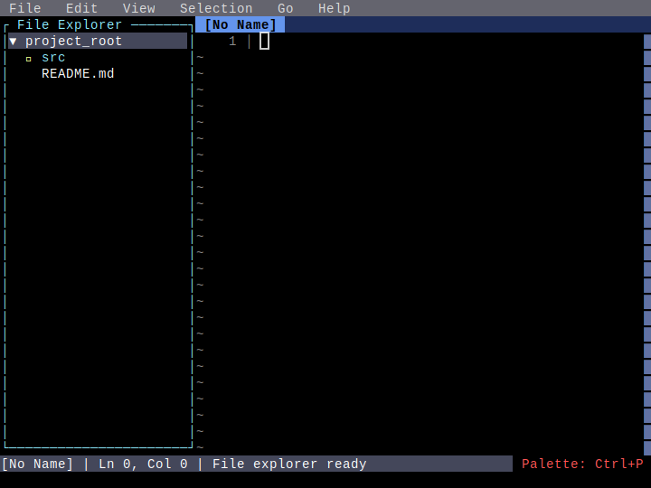
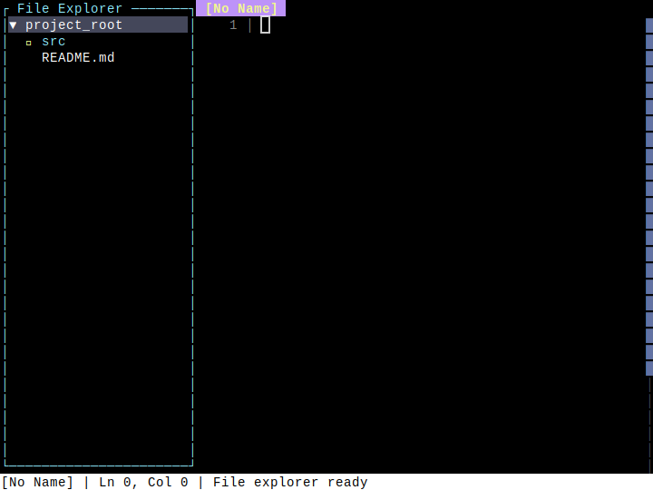
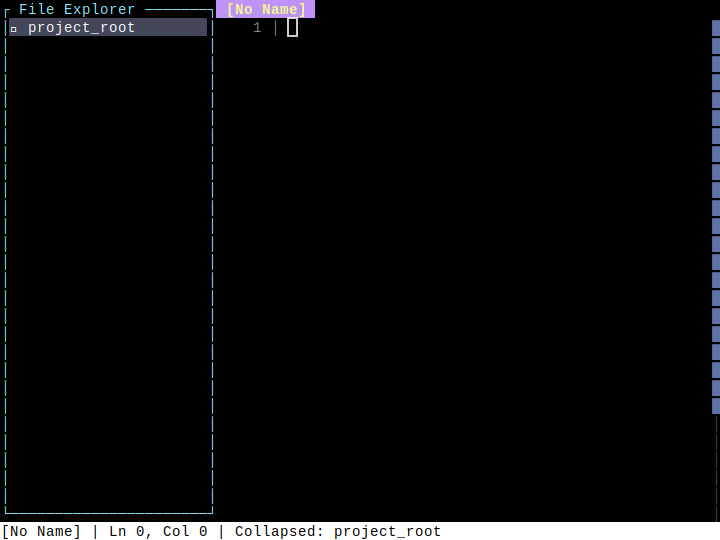

# File Explorer

**Category**: File Management

*Opening and navigating the file explorer*

---

## Step 1: initial

*Editor before opening file explorer*

## Step 2: explorer_open

*File explorer opened in left pane*

## Step 3: file_selected

*File selected in explorer*

## Step 4: dir_expanded

*Directory expanded to show contents*

