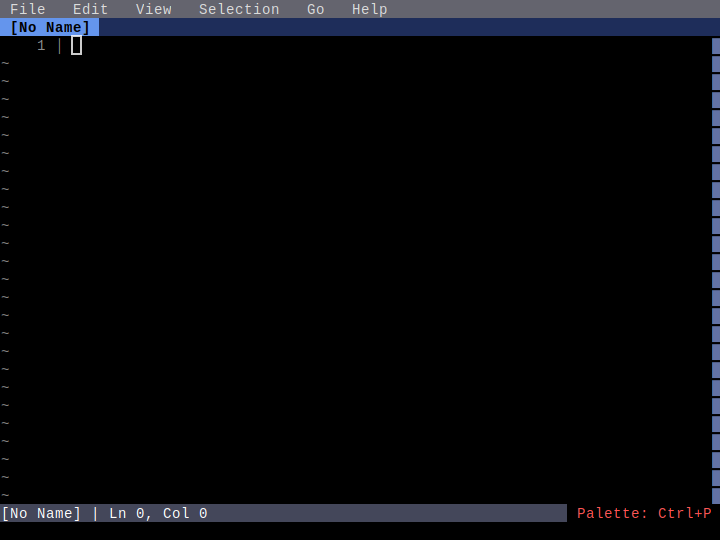

# Help System

**Category**: Core Features

*Viewing keybindings and help information*

---

## Step 1: initial

*Editor before opening help*

## Step 2: help_open

*Help panel showing all keybindings*

