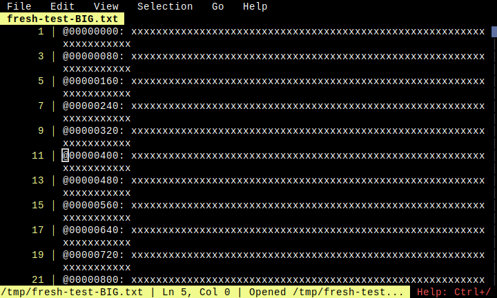
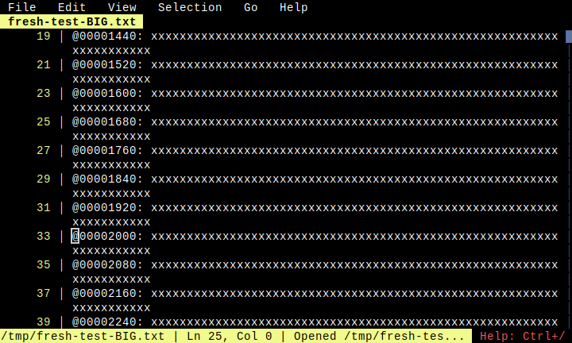
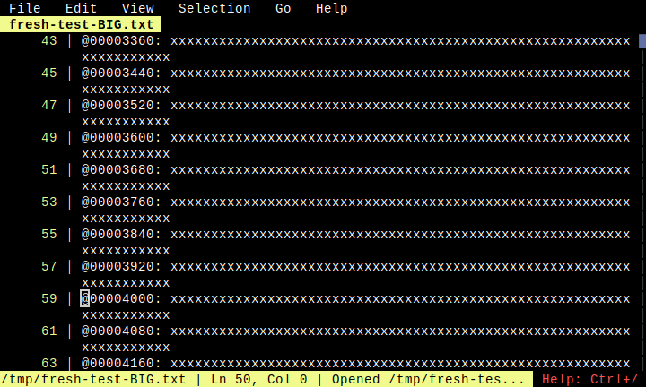

# Large File Cursor Movement

**Category**: Large File Mode

*Testing cursor movement with Down arrow in large file mode*

---

## Step 1: initial

*File opened at top*

## Step 2: after_5_down

*After pressing Down 5 times*

## Step 3: after_25_down

*After pressing Down 25 times*

## Step 4: after_50_down

*After pressing Down 50 times*

