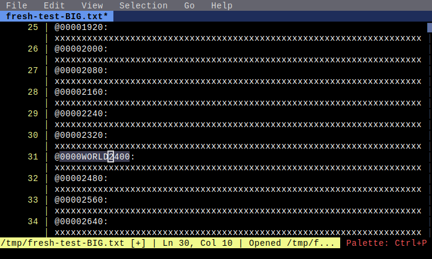

# Large File Typing

**Category**: Large File Mode

*Testing that typed characters appear at cursor position in large file mode*

---

## Step 1: initial

*File opened at top*

## Step 2: before_typing

*Positioned at line 10 before typing*

## Step 3: after_typing

*After typing 'HELLO'*

## Step 4: after_second_typing

*After typing more text deeper in file*

