# Multi-Language Highlighting

**Category**: Syntax Highlighting

*Syntax highlighting working across all supported programming languages*

---

## Step 1: rust_highlighting

*Rust code with syntax highlighting*

## Step 2: python_highlighting

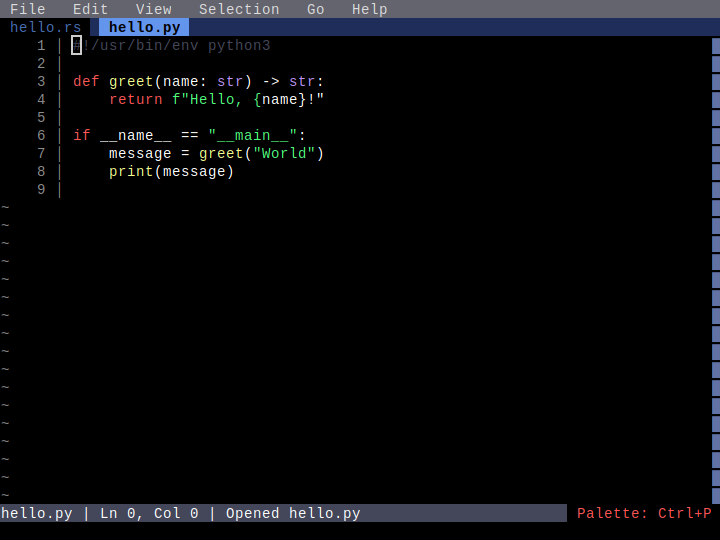

*Python code with syntax highlighting*

## Step 3: javascript_highlighting

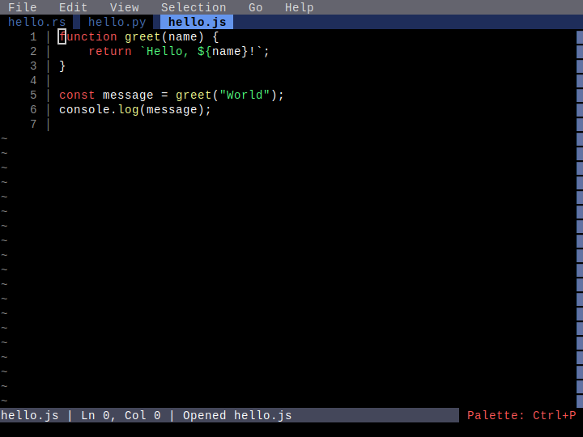

*JavaScript code with syntax highlighting*

## Step 4: typescript_highlighting

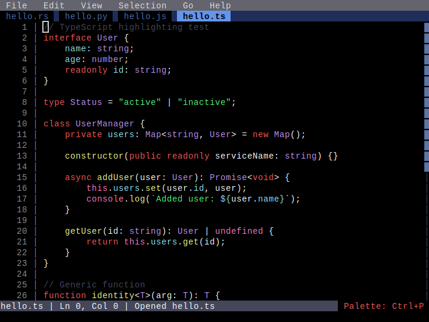

*TypeScript code with syntax highlighting*

## Step 5: html_highlighting

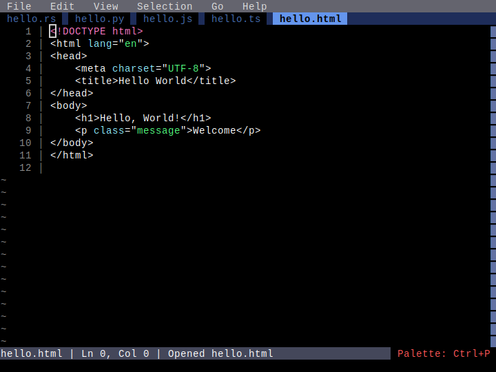

*HTML code with syntax highlighting*

## Step 6: css_highlighting

*CSS code with syntax highlighting*

## Step 7: c_highlighting

*C code with syntax highlighting*

## Step 8: cplusplus_highlighting

*C++ code with syntax highlighting*

## Step 9: go_highlighting

*Go code with syntax highlighting*

## Step 10: json_highlighting

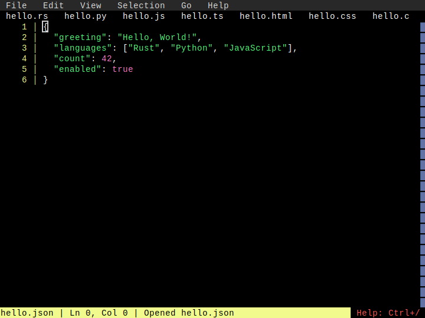

*JSON code with syntax highlighting*

## Step 11: java_highlighting

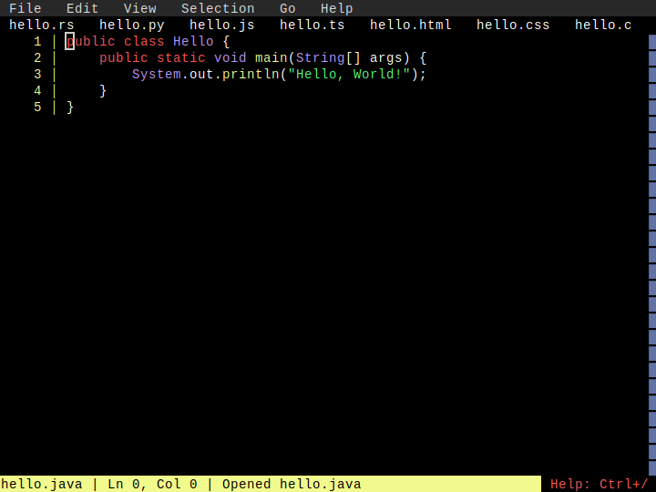

*Java code with syntax highlighting*

## Step 12: csharp_highlighting

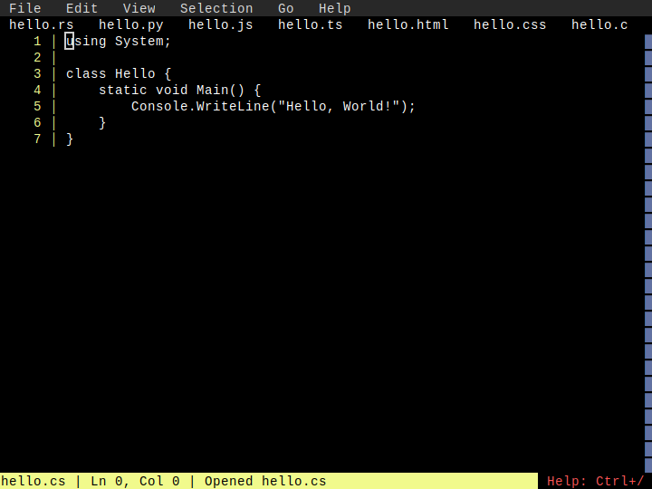

*C# code with syntax highlighting*

## Step 13: php_highlighting

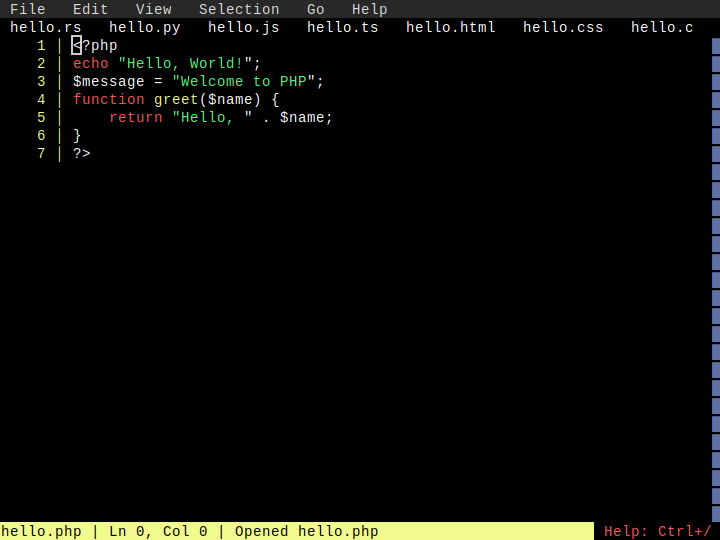

*PHP code with syntax highlighting*

## Step 14: ruby_highlighting

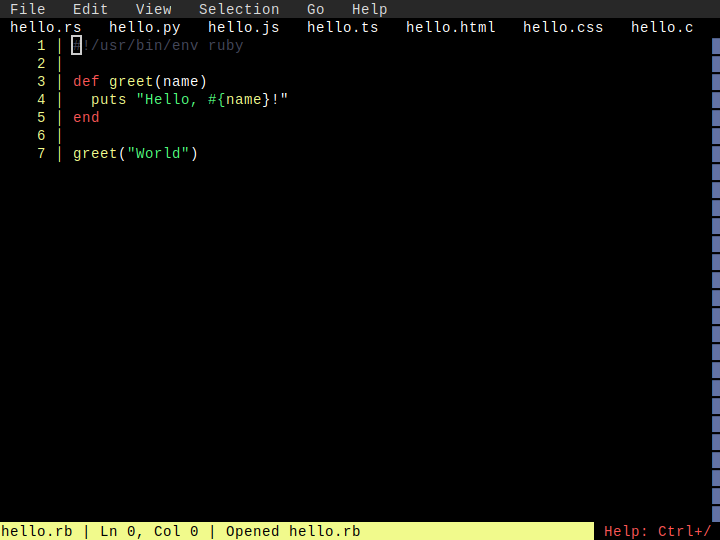

*Ruby code with syntax highlighting*

## Step 15: bash_highlighting

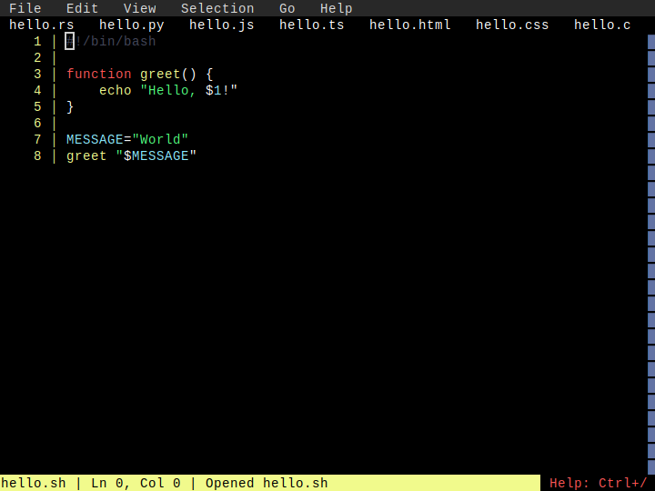

*Bash code with syntax highlighting*

## Step 16: lua_highlighting

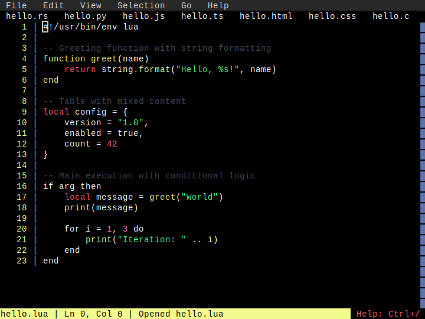

*Lua code with syntax highlighting*

