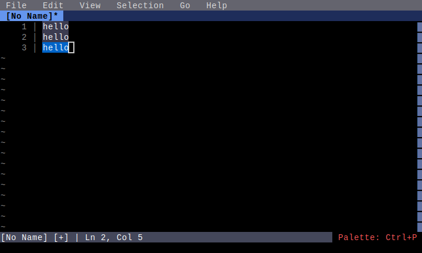
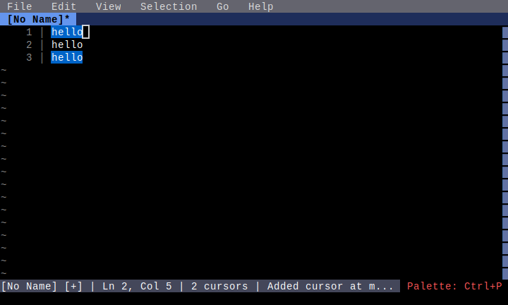
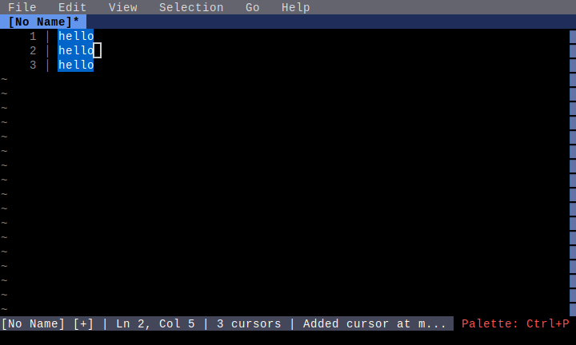

# Multiple Cursors

**Category**: Advanced Editing

*Using multiple cursors for simultaneous edits*

---

## Step 1: initial_text

*Three lines with 'hello'*

## Step 2: word_selected

*First word selected*

## Step 3: two_cursors

*Second occurrence selected (two cursors)*

## Step 4: three_cursors

*All occurrences selected (three cursors)*

