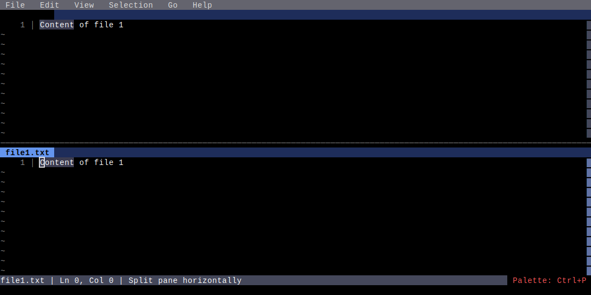
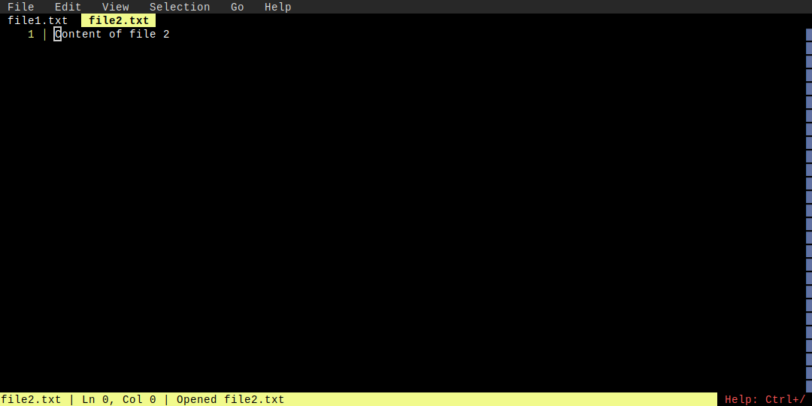

# Split View

**Category**: Layout

*Working with split panes*

---

## Step 1: single_file

*Single file open*

## Step 2: horizontal_split

*Editor split horizontally*

## Step 3: two_files

*Two files visible in split panes*

